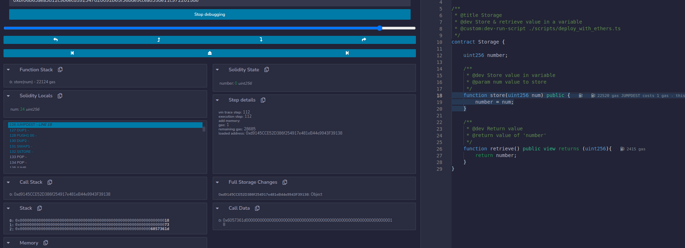
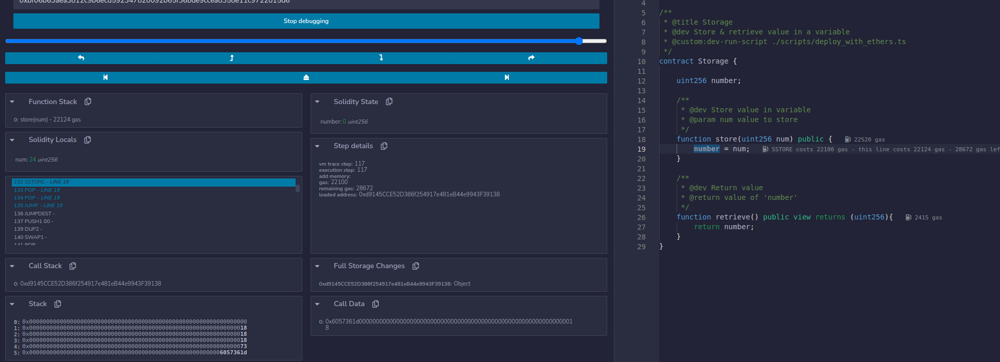
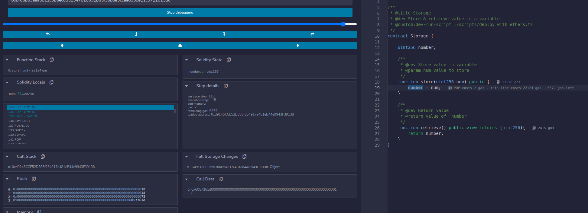
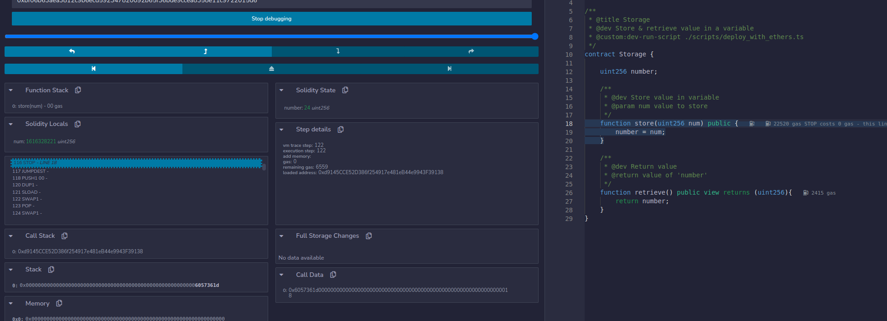

# Homework 3

***
## What are the advantages and disadvantages of the 256 bit word length in the EVM?
The Ethereum Virtual Machine (EVM) uses a 256-bit word size for its registers, memory, and stack. 

<b>Advantages</b>: 
1. <b>High precision</b>: The 256-bit word length allows for high precision arithmetic, which is useful for applications that require accurate calculations, such as financial contracts. Since there are no decimals in Ethereum, this is especially useful to help represent <i>n</i>.<i>m</i>-bit fixed point numbers to high precision. 

2. <b>Large address space</b>: The 256-bit word size allows for a large address space, which means there can be more addresses in the system. This is important for scalability and future expansion of the Ethereum network. 

3. <b>Built-in support for cryptography</b>: The 256-bit word size is also useful for built-in support for cryptography, which is an important feature of Ethereum. 

<b>Disadvantages</b>: 
1. <b>Increased gas costs</b>: The use of 256-bit words increases the amount of gas needed to execute operations because more bits need to be processed. 

2. <b>Increased storage requirements</b>: Storing data as 256-bit words rather than smaller sizes can increase the storage requirements of the network, which could affect scalability. 

3. <b>Complexity</b>: Working with 256-bit words can be complex and requires specialized knowledge and tooling. 

<b>Summary</b>: 
In summary, the 256-bit word lenght provides benefits to the EVM like high precision, large address space, and support for cryptography. However, it aslo has drawbacks like increased gas cost, storage requirements, and complexity. 

***
## What would happen if the implementation of a precompiled contract varied between Ethereum clients?
If the implementation of a precompiled contract varies between Ethereum clients, then it can lead to inconsistent results when executing the same code. For example, if a contract relies on a specific implementation or behavior of a precompiled contract that is not consistent across clients, it may produce different results depending on which client is used to execute the contract. 

Inconsistencies between clients can cause problems for developers who build applications on top of Ethereum and rely on consistent behavior across all clients. It could lead to issues like incorrect calculations, unexpected exceitpions and other unforeseen errors. 

To avoid such inconsistencies, it is important for Ethereum clients to maintain compatibility with each other and ensure that precompiled contracts are implemented consistently across all clients. Standardization of precompiled contracts across various clients can help to avoid any discrepancies and make it easier for developers to build reliable decentralized applications. 

***
## Using Remix, write a simple contract that uses a memory variable. Then using the debugger, step through the function and inspect the memory.
Entering `Storage` contract's `store(uint256)` function: 

 

Input value `24` stored in memory and about to be stored in `number` storage variable via `sstore` opcode: 

 

Input value `24` now stored in the contract's storage variable `number`: 

 

Function `store(uint256)` close out: 

