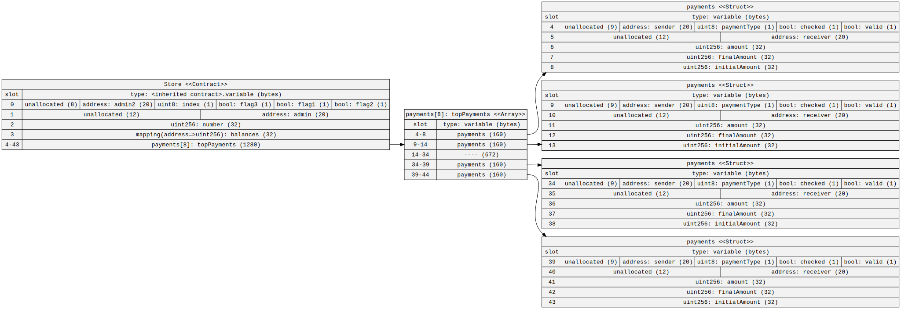

# Homework 4

***
## Optimising Storage
Using the <a href="https://github.com/naddison36/sol2uml">sol2uml</a> tool, find how many storage slots <a href="https://gist.github.com/extropyCoder/6e9b5d5497b8ead54590e72382cdca24">this contract</a> is using. 

By reordering the variables, reduce the number of storage slots needed. 

<b>Original Storage Layout</b>: 
[Original Contract](./original__Store.sol) 
`sol2uml storage 01-week/hw/Homework04/Store.sol -c Store -o 01-week/hw/Homework04/img/original-store-storage-report.svg` 

 

<b>Updated Storage Layout</b>: 
[Updated Contract](./Store.sol) 
`sol2uml storage 01-week/hw/Homework04/Store.sol -c Store -o 01-week/hw/Homework04/img/store-storage-report.svg` 

