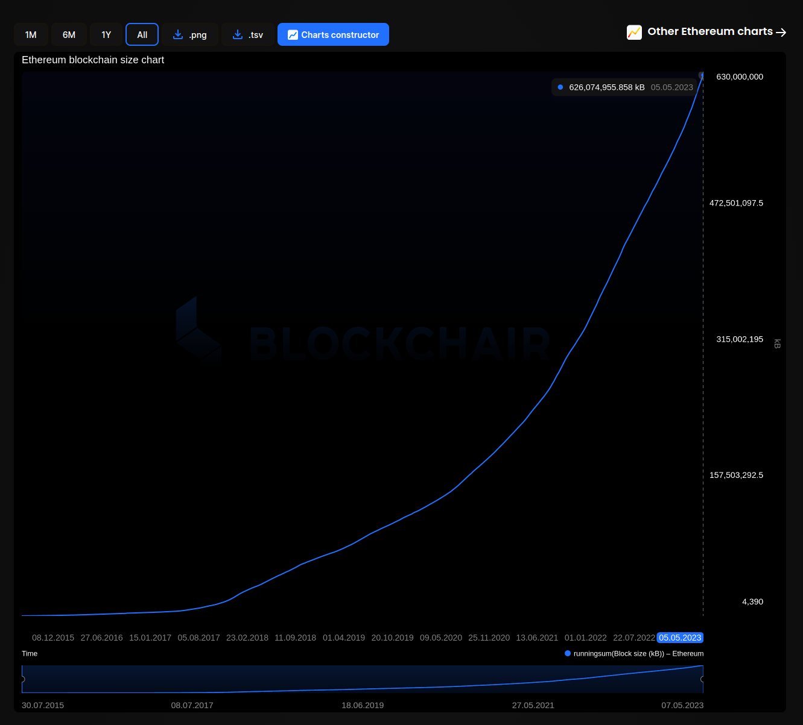

# Homework 1

***
## Why is client diversity important for Ethereum
Client diversity on the Ethereum blockchain is important for several reasons: 
1. <b>Decentralization</b>: Ethereum aims to be a decentralized platfrom that is not controlled by any single, centralized entity. If all nodes on the network run the same client software, this creates a centralized point of failure. If there is a bug or vulnerability within that software, it could potentially affect the entire network. By having multiple different clients with different implementations and code bases, the risk of a catastrophic failure is greatly reduced. 

2. <b>Reliability and Resilience</b>: Having multiple client implementations helps ensure greater reliability and resilience of the network. If one implementation experiences issues (such as a software bug, resource limitations, or hardware failure), other implemenations can continue to participate and propagate blocks throughout the network. This helps reduce the likelihood of a network failure or disruption and makes the network more resilient to attacks or other malicious activity. 

3. <b>Innovation</b>: Client diversity drives innovation within the ecosystem. Different client teams may have different priorities, features, and development focus areas, leading to more experimentation and alternative implementations. This ultimately leads to more rapid growth and development of the Ethereum ecossystem as a whole. 

In summary, client diversity helps ensure the security, stability, and decentralization of the network. 

***
## Where is the full Ethereum state held?
The full ethereum state is held by every node that runs an Ethereum client. 

The state includes all the data related to the current state of the Ethereum blockchain, including account balances, contract code and storage, transaction history, block headers, and other network-related information. The state is constantly being updated as new transactions are added to the network and new blocks are mined. 

Each Ethereum node maintains its own copy of the full state. When a node joins the network for the first time, it must download the entire state from other nodes on the network. As the node continues to participate in the network, it will continue to update its own copy of the state to refelct the latest changes. 

It's workth nothing that the Ethereum state is quite large and can consume a significant amount of disk space. As of 06-May-2023, the size of the network is just under 630 GB (<a href="https://blockchair.com/ethereum/charts/blockchain-size">reference</a>). 

 

***
## What is a replay attack? Which two pieces of information can prevent it?
In the context of the Ethereum blockchain, a replay attack is a type of attack in which an attacker attempts to broadcast a valid transaction that has already been executed on the Ethereum network again. This might happen in situations where there is a hard fork or chain split. 

For example, if a user sends a transaction on the original chain and afterwards, a hard fork occurs, the transaction can be rebroadcast by an attacker on the new chain, resulting in the user's funds being stolen. 

<b>Chain ID</b>: 
To prevent replay attacks, Ethereum introduced the replay protection mechanism after its Byzantium hard fork update. It adds a unique identifier, the chain ID, to each transaction and makes sure that transactions broadcasted on one network cannot be processed on another network. The chain ID serves as a way to differentiate between the original Ethereum network and any subsequent networks that may emerge. Essentially, it helps to ensure that transactions broadcasted on one network cannot be processed on another network. This also ensures that users' funds remain secure during hard forks or chain splits. 

<b>Transaction Nonce</b>: 
Another element used to prevent replay attacks is the transaction nonce. The nonce is a unique number associated with each transaction, which is incremented for each new transaction sent from the same sender account. By including the nonce in the signed data of a transaction, it ensures that each transaction is unique and can only be executed once. 

When a replay attack occurs, an attacker will try to re-broadcast an old transaction on a different network or to a different recipient. However, with the inclusion of the nonce in the signed data of a transaction, the transaction can only be executed if its nonce value matches the next sequential number expected by the network. 

Therefore, by including the nonce in the signed data of the transaction, Ethereum provides an additional layer of security against replay attacks since attackers cannot simply replay old transactions due to the uniquemenss of the nonces. 

<b>Summary</b>: 
It is important to note that the chain ID and nonce both play important roles in preventing replay attacks and work together to ensure a higher degree of security for user transactions. 

***
## In a contract, how do we know who called a view function?
When a function is called in a smart contract, Ethereum creates an <strong>execution context</strong> containing all the information related to the execution, including the caller's address. This informatino is stored in the <strong>calldata</strong>, along with the function arguments. 

The <strong>msg.sender</strong> global variable retrieves the caller's address from this execution context, which is available to every non-internal function (view or non-view) of the contract.