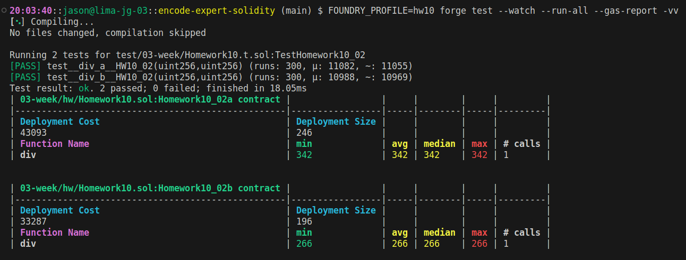

# Optimisation II

---

## 1. Why are negative numbers more expensive to store than positive numbers? 

...

---

## 2. A test between two equivalent mathmatical operations: 

1. `result = numerator / denominator;` - [Homework10_02a](Homework10.sol) 
2. `assembly { result := div(numerator, denominator) }` - [Homework10_02b](Homework10.sol) 

---
